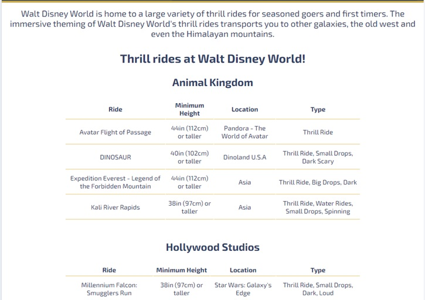
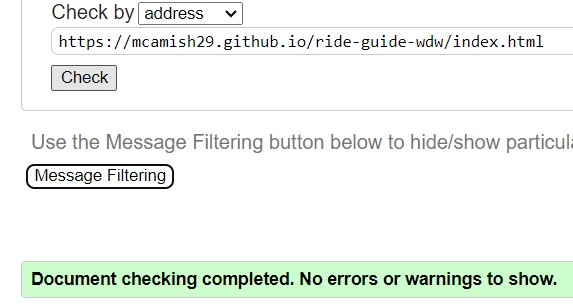
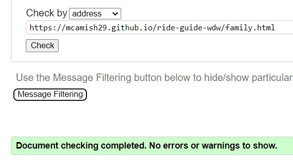

# Ride Guide: Walt Disney World

Ride Guide: Walt Disney World is a website that allows users to look for information for specific rides across all four Walt Disney World theme parks. The rides are seperated into two sections "Thrill Seekers" and "Family Fun", along side a competition page for users to enter. View the live site [here](https://mcamish29.github.io/ride-guide-wdw/index.html)

## Features

### Site Wide
* Navigation Menu
    * Contains links to Home, Thrill Seekers, Family Fun and Competition pages and will be responsive on all devices
        *Responsive view on mobiles features a bar icon and drop down function for the users
    * The navigation bar will allow users to easily navigate between these pages within the site on any device

* Footer
    * The footer will contain links to social media websites that will open in new tabs. All icons are accesible to the visually impaired who may be using a screen reader, this is done by the use of aria labels.    

* Favicon
    * An on theme favicon will appear across all pages to allow the user to easily identify the page tabs

* 404 Page
    * A 404 error page has been created if a user goes to a broken link.
    * The users have the ability to navigate back to the home page via link found on the 404 error page, without using browsers back button

### Landing Page 
* Landing page hero image
    * The hero image will display Cinderlla Castle
    * There is a cover text in place to advise the user what the webpage is about

* Body of landing page
    * Two paragraphs will feature on the landing page to advise users about Walt Disney World and how the rides have been split into groups
    * An additional link to the competition page can be found to assist users to enter
    * Three images will also be on the page showcasing rides found at Walt Disney World.
        * The images are accesible for visually impaired users who may be using a screen reader, this is done by the use of aria labels
    * All sections are responsive and will display on any device

### Thrill Seekers Page
* Thrill seekers hero image
    * The hero image will display a thrill ride found in Walt Disney World
    * There is a cover text in place to advise the user of the current page they are on

* Body of thrill seekers page
    * A paragraph will feature on the thrill seekers page advising users of the thrill rides.
    * A table will contain the information of all rides advising users of ride name, minimum height requirement, location in the park and type of ride
        * Each table has a heading to advise the users of what park the rides are in
    * All sections are responsive and will display on any device

### Family Fun Page
* Family Fun hero image
    * The hero image will display a family ride found in Walt Disney World
    * There is a cover text in place to advise the user of the current page they are on

* Body of family fun page
    * A paragraph will feature on the family fun page advising users of the family rides.
    * A table will contain the information of all rides advising users of ride name, minimum height requirement, location in the park and type of ride
        * Each table has a heading to advise the users of what park the rides are in
    * All sections are responsive and will display on any device    
 

### Competition Page
* Competition hero image
    * The hero image will display a selection of Disny ballons
    * There is a cover text in place to advie the user of the current page they are on

* Body of the competition page
    * A sentence will feature on the page to prompt the user to enter the form
    * A form is in place to allow the user to enter their information
        * First Name (required, type=text)
        * Last Name (required, type=text)
        * Email (required, type=email)
        * Paragraph question with radio buttons (type="radio" name="visit-time")
        * Paragraph question with text entry box (type="text")
        * Paragraph question with radio buttons (type="radio" name="visit-park")
    * On successful completion and submission of the survery form, the user will be navigsted to a thank-you.html displaying successful message    
   

 ### Thank You  Page
 * Body of thank you page
    * The user will be greeted with a thank you heading, image and link back to home page

### Existing Features

* Responsive design
* Survery form and thank you page
* Tables outlining ride information
* Additional link to competition page on index.html

### Features left to imlpement

* Survey form to be updated to post method for succesful competition results

* Video media of rides from YouTube

* Tables to be interactive to allow filtering and search capabilities

## Technologies
* HTML
    * HTML was used as the main language to develope the structure of the website
* CSS
    * An external file was used for the syling of the website
* Visual Studio Code
    * The development of the website was done using Visul Studio Code IDE
    * Git commits were done using Visual Studio Code
* GitHub
    * Source code is hosted on GitHub and deployed using Git Pages
* Git/ GitHub Desktop
    * Used to pushcode during development
* Font Awesome
    * https://fontawesome.com/ was used to obtain icons for social media links and dropdown nav bar
* Tinyjpg
    * https://tinyjpg.com/ was used to reduce image sizes across website
* Flaticon.com
    * https://www.flaticon.com/ was used to obtain favicon
*  Convertio.co
    * https://convertio.co/ was used to convert jpg & png images into webp
* Pexels
    * https://www.pexels.com/ was used to obtain free stock images used across website 
* Unsplash
    * https://unsplash.com/ was used to obtain free stock images used across website
 * Pixabay
    * https://pixabay.com/  was used to obtain free stock images used across website 

## Testing

### Responsiveness

All of the web pages were tested to show responsiveness from 280px upwards.

**Steps taken to test responsivess:**

1. Open browser
2. Navigate to [Ride Guide: Walt Disney World](https://mcamish29.github.io/ride-guide-wdw/index.html)
3. Open developer tools by right clicking and selecting inspect
4. At the top of the page reduce dimensions to 280px x 858px 
5. click and drage the responsive window to maximum width

**Expected:** 

Fully responsive website across all pages with no images or content being stretched or warped
No horizontal scroll present
Elements no overlapping creating a bad user experience

**Actual**

The beahaviour of the website was as expected with the exception of content overlapping on Thrill Seekers and Family Funy pages creating a horizontal scroll bar 

### Devices

The website was also tested on below devices to ensure no responsive issues

- Samsung Galaxy s22 Ultra
- Apple iPad prod

### Accessibility

[Wave Accessibility](https://wave.webaim.org/) was used during development and final stages of testing to check for any accessibility issues.

Issue: Contrast errors we found on Thrill Seekers, Family Fun and Competition page due to font color

Fix: Font color adjusted to matching theming of page

### Lighthouse Testing

### Functional Testing

**Navigation**

Through out development testing was carried out to ensure all links on pages navigated to relevant pages. The user can complete these with clicking on naviagation links found on all pages

**Navigation Bar**

| Navigation Link | Page to Load |
| --------------- | ------------ |
| Home            | index.html   |
| Thrill Seekers  | thrill.html  |
| Family Fun      | family.html  |
| Competition     | comp.html    |

**Competition Link**

| Navigation Link                     | Page to Load |
| ----------------------------------- | ------------ |
| Click here to enter our competition | comp.html    |

**404 Return**

| Navigation Link              | Page to Load |
| ---------------------------- | ------------ |
| please click here to go back | index.html   |

**Form Testing**

The form on the competition page was tested to ensure it functioned as planned when correct or incorrect data was input. The following tests were conducted.

*Test 1: Enter correct information*

1. Navigate to competition page
2. Enter first name
3. Enter last name
4. Enter email address
5. Select radio button option
6. Enter text in text field option
7. Select radio button option
8. Click submit

Expected:
Form submits with no errors taking user to thank-you.html page

Actual:
Website displayed no errors resulting in successful submission taking user to thank-you.html

*Test 2: Missing first name field*

1. Navigate to competition page
2. Leave first name blank
3. Enter last name
4. Enter email address
5. Select radio button option
6. Enter text in text field option
7. Select radio button option
8. Click submit

Expected:
Form displays require field error and form is not able to submit

Actual:
Website displayed error highlighting to use this field is required to submit

*Test 3: Missing last name field*

1. Navigate to competition page
2. Enter first name 
3. Leave last name blank
4. Enter email address
5. Select radio button option
6. Enter text in text field option
7. Select radio button option
8. Click submit

Expected:
Form displays require field error and form is not able to submit

Actual:
Website displayed error highlighting to use this field is required to submit

*Test 4: Missing @ in email field*

1. Navigate to competition page
2. Enter first name 
3. Enter last name
4. Enter email address without @
5. Select radio button option
6. Enter text in text field option
7. Select radio button option
8. Click submit

Expected:
Form displays require field error and form is not able to submit

Actual:
Website displayed error highlighting to use this field is required to submit

*Test 5: Leave non-required information blank*

1. Navigate to competition page
2. Enter first name
3. Enter last name
4. Enter email address
5. Do not select radio button option
6. Leave text field option blank
7. Do not select radio button option
8. Click submit

Expected:
Form submits with no errors taking user to thank-you.html page

Actual:
Website displayed no errors resulting in successful submission taking user to thank-you.html

**Footer Social Media Icons/ Links**

To ensure the icons on the footer opened the correct social media pages on a new tab, each icon was clicked on and opened as expected.

### Validator Testing

- HTML
    - No errors were returned when passing through the official [W3C validator](https://validator.w3.org)

- CSS
    - No errors were returned when passing through the official [(Jigsaw) validator](https://jigsaw.w3.org)  

### Unfixed bugs
Responsiveness of the website worked on all devices. The images on the index.html positioning needs to be address on larger screen sizes to have a better screen prescence

### Version Control

The website was created and commited using Visual Studio Code, to be then pushed by GitHub desktop to the remote repository 'ride-guide-wdw'

### Deployment to GitHub Pages

The site was deployed to GitHub pages. 
- The steps to deploy are as follows: 
  - On the repository for 'ride-guide-wdw' select settings ont he navigation options along the top
  - Select 'Pages' on the left hand side
  - Select 'Main' as the source branch
  - Click the save button
  - A newly created link to the website will be created

A link to the deployed page can be found here - https://mcamish29.github.io/ride-guide-wdw/

## Credits

* [Custom 404 page](https://www.youtube.com/watch?v=Jj42_s3KnuM)
    * Steps on how to create a custom 404 error page was taken from this video

### Content
    * Ride information was obtained from Walt Disney World

### Media

* Media was taken from freestock websites such as [Pexels](https://www.pexels.com/), [Pixabay](https://pixabay.com/) and [Unsplash](https://unsplash.com/)
